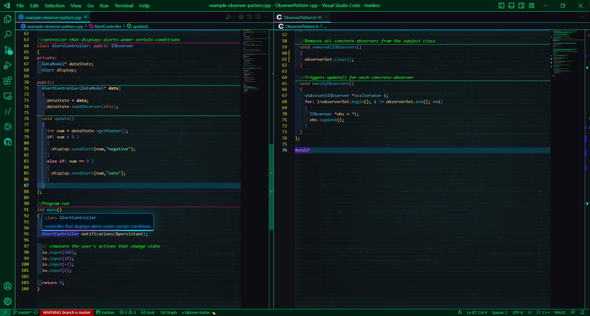
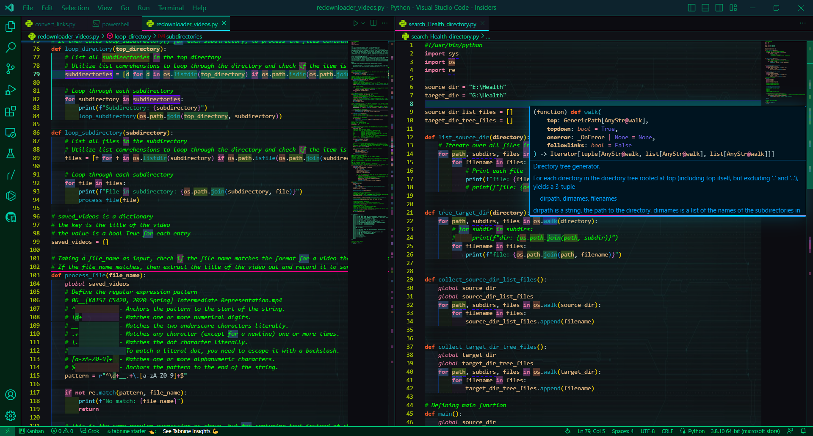
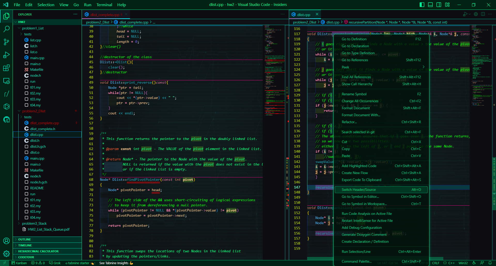
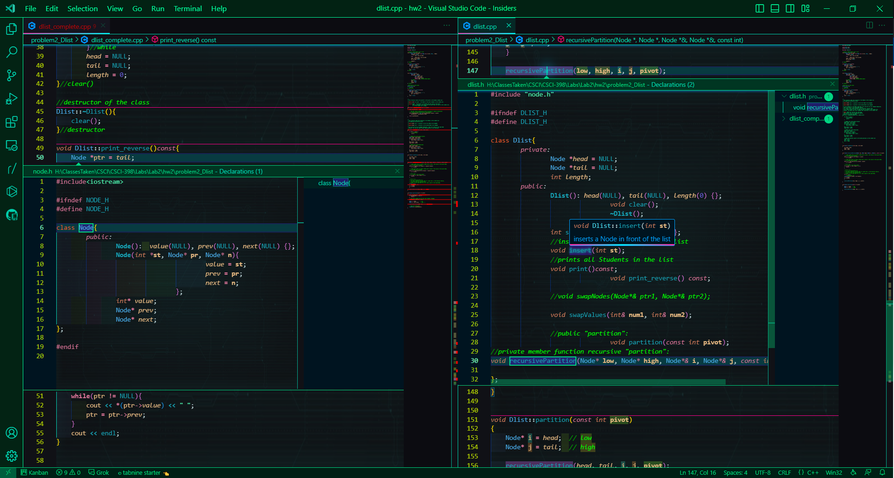
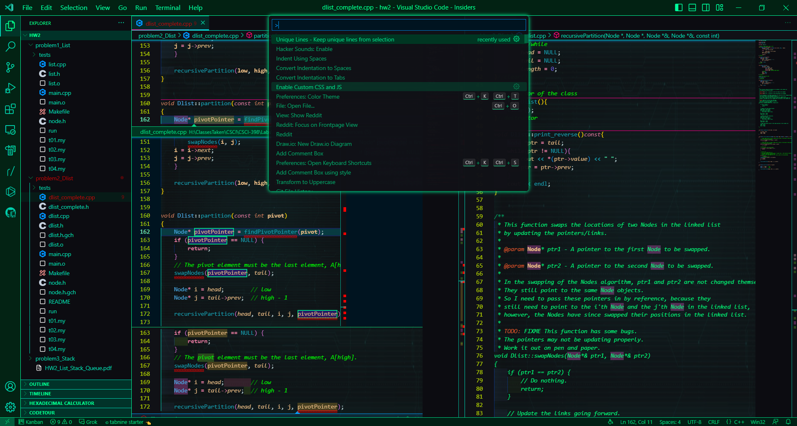
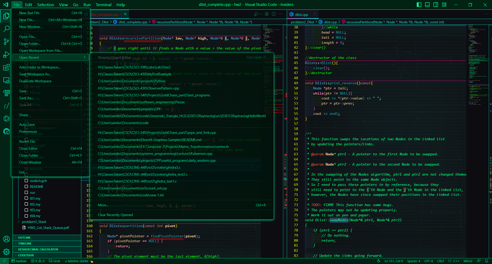
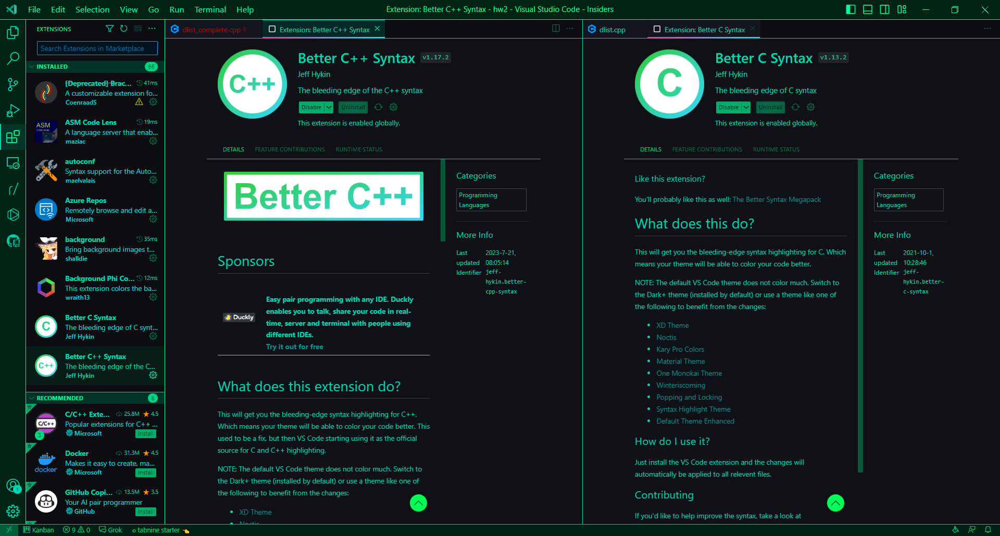
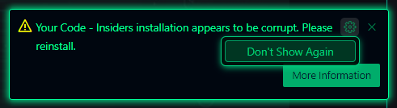

<p align="center">
   
</p>

# CyberHacker Theme README

The **CyberHacker Theme** is a dark theme for Visual Studio Code Insiders that is inspired by the cyberpunk hackers genre. Although it was developed for the Insiders version, it may work for regular Visual Studio Code as well.

This theme is designed to:

 - be easy on the eyes, as a dark theme with bright text colors, thus reducing the eye strain
 - give semantic meaning to theme's colors, highlighting individual codes for *O(1)* reading time
 - have a cyberpunk or futuristic appeal, making you feel like a hacker

This theme supports bleeding-edge syntax highlighting for C and C++ languages. To get the most out of this theme you need to install [Better C++ Syntax](https://marketplace.visualstudio.com/items?itemName=jeff-hykin.better-cpp-syntax) or the [Better Syntax Pack](https://marketplace.visualstudio.com/items?itemName=jeff-hykin.better-syntax). Other languages may also work well with this theme, but I haven't tried it.

## Pictures of this theme
















## Installing this theme


### Step 1 - Installing Better Syntax

Please install the [Better Syntax Pack](https://marketplace.visualstudio.com/items?itemName=jeff-hykin.better-syntax) first before continuing.

### Step 2 - Installing CyberHacker

In your **settings.json** set the color theme.

```
"workbench.colorTheme": "CyberHacker Theme",
```

### Step 3 - Activating Glow Effects

This theme features special effects that appear upon certain actions, such as collapsing/expanding braces and hovering over certain code elements.

For this feature you need to install the [Custom CSS and JS Loader](https://marketplace.visualstudio.com/items?itemName=be5invis.vscode-custom-css) extension.

To activate the glow effects, add these lines to your **settings.json**.
Naviagate to the directory where the **CyberHacker Theme** is installed, and find the `glow_effects.css`

```
"vscode_custom_css.imports": [
    "file:///C:/Users/username/.vscode-insiders/extensions/krebrov.cyberhacker-theme-0.0.1/glow_effects.css"
],
```

Then Activate command "Reload Custom CSS and JS".

#### NOTE: Every time after Visual Studio Code is updated, please re-enable Custom CSS.

### Step 4 - Activating Custom Background

Please install the [vscode-background](https://marketplace.visualstudio.com/items?itemName=shalldie.background) extension to use the custom background.

To activate the custom background, add these lines to your **settings.json**.
Naviagate to the directory where the **CyberHacker Theme** is installed, and find the `terminal_background_center.PNG`

```
"background.enabled": true,
"background.useDefault": false,
"background.useFront": false,
"background.style": {
    "content": "''",
    "pointer-events": "none",
    "position": "absolute",
    "z-index": "99999",
    // "width": "100%",
    // "height": "100%",
    "background-size": "100% 100%",
    "background-repeat": "no-repeat",
    "background-position": "left top",
    "background-clip": "border-box",
    "opacity": 0.5
},
"background.customImages": [
    "file:///C:/Users/username/.vscode-insiders/extensions/krebrov.cyberhacker-theme-0.0.1/terminal_background_center.png",
    "file:///C:/Users/username/.vscode-insiders/extensions/krebrov.cyberhacker-theme-0.0.1/terminal_background_center.png",
    "file:///C:/Users/username/.vscode-insiders/extensions/krebrov.cyberhacker-theme-0.0.1/terminal_background_center.png",
    "file:///C:/Users/username/.vscode-insiders/extensions/krebrov.cyberhacker-theme-0.0.1/terminal_background_center.png",
    "file:///C:/Users/username/.vscode-insiders/extensions/krebrov.cyberhacker-theme-0.0.1/terminal_background_center.png",
    "file:///C:/Users/username/.vscode-insiders/extensions/krebrov.cyberhacker-theme-0.0.1/terminal_background_center.png"
],
```

If Visual Studio Code complains about that it is corrupted, click the wheel, then click “Don't Show Again”.
You do not need to reinstall.



### Step 5 - Installing Other Optional Reccomended Extensions

The following are some extensions that I reccomend to make this theme look better. These are the extensions that I use together with this theme for aesthetics. They are optional.

After each extension are some reccomended settings that should be added to the **settings.json**.

[High Contrast Icons](https://marketplace.visualstudio.com/items?itemName=74th.high-contrast-icons) extension

```
"workbench.iconTheme": "high-contrast-icons-dark",
```

[Bracket Pair Colorizer 2](https://marketplace.visualstudio.com/items?itemName=CoenraadS.bracket-pair-colorizer-2) extension

```
"bracket-pair-colorizer-2.activeScopeCSS": [
    "borderStyle : solid",
    "borderWidth : 1px",
    "borderColor : {color}",
    "opacity: 0.5"
],
"bracket-pair-colorizer-2.depreciation-notice": false,
```

[Highlight](https://marketplace.visualstudio.com/items?itemName=fabiospampinato.vscode-highlight) extension

```
"highlight.regexes": {
    "(// ?TODO:?)(.*)": [
        {
            "overviewRulerColor": "#ffcc00",
            "backgroundColor": "#ffcc00",
            "color": "#1f1f1f",
            "fontWeight": "bold"
        },
        {
            "backgroundColor": "#d9ad00",
            "color": "#1f1f1f"
        }
    ],
    "(// ?FIXME:?)(.*)": [
        {
            "overviewRulerColor": "#ff0000",
            "backgroundColor": "#ff0000",
            "color": "#1f1f1f",
            "fontWeight": "bold",
        },
        {
            "backgroundColor": "#d90000",
            "color": "#1f1f1f"
        }
    ],
    "(// )(@\\w+)": [
        {},
        {
            "color": "#4de0ff"
        }
    ]
},
```

[Background Phi Colors](https://marketplace.visualstudio.com/items?itemName=wraith13.background-phi-colors) extension

```
"backgroundPhiColors.clipDelay": 29,
"backgroundPhiColors.lineEnabled": false,
"backgroundPhiColors.enabledPanels": true,
"backgroundPhiColors.indent": "4 spaces",
"backgroundPhiColors.indentErrorEnabled": false,
```

[Footsteps](https://marketplace.visualstudio.com/items?itemName=Wattenberger.footsteps) extension

```
"footsteps.highlightColor": "rgb(113, 240, 218)",
"footsteps.maxNumberOfChangesToHighlight": 7,
"footsteps.maxNumberOfChangesToRemember": 7,
"footsteps.highlightColorMaxOpacity": 0.3,
```

The following extensions do not require any additions into the **settings.json**.

[Separators](https://marketplace.visualstudio.com/items?itemName=alefragnani.separators) extension

[Trailing Spaces](https://marketplace.visualstudio.com/items?itemName=shardulm94.trailing-spaces) extension

[Output Colorizer](https://marketplace.visualstudio.com/items?itemName=IBM.output-colorizer) extension

[Hacker Sounds](https://marketplace.visualstudio.com/items?itemName=mattogodoy.hacker-sounds) extension

[Git Graph](https://marketplace.visualstudio.com/items?itemName=mhutchie.git-graph) extension

[C/C++ MATH Formula Viewer](https://marketplace.visualstudio.com/items?itemName=Hyeon.c-math-viewer) extension

[Hex Hover Converter](https://marketplace.visualstudio.com/items?itemName=maziac.hex-hover-converter) extension
